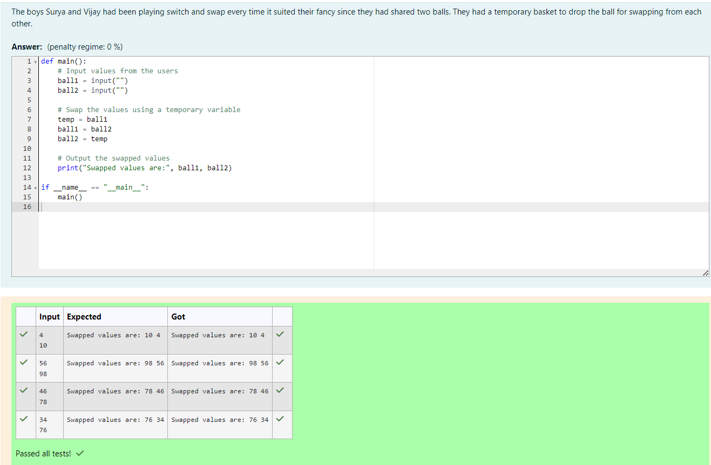

# Swapping-two-values
NAME : DEVA DHARSHINI I

REGISTER NUMBER : 212223240026

DEPARTMENT : AIML

## AIM:
To write a python program for swapping of two values
## EQUIPEMENT'S REQUIRED: 
PC
Anaconda - Python 3.7
## ALGORITHM: 
### Step 1:  
Get the two values from the user
### Step 2: 
Assign the value of second variable to a temporary variable 
### Step 3: 
Assign the value of the first variable to the second variable.
### Step 4:  
Assign the value in temporary variable to the first variable
### Step 5: 
Print both the values it would be interchanged
### Step 6: 
End the program
## PROGRAM:
```
Program developed by : Deva Dharshini I
Register number : 212223240026


def main():

    ball1 = input("")
    ball2 = input("")

    temp = ball1
    ball1 = ball2
    ball2 = temp

    print("Swapped values are:", ball1, ball2)

if __name__ == "__main__":
    main()
```

## OUTPUT :




## RESULT:
Thus the swapping of two values are successfully executed.


